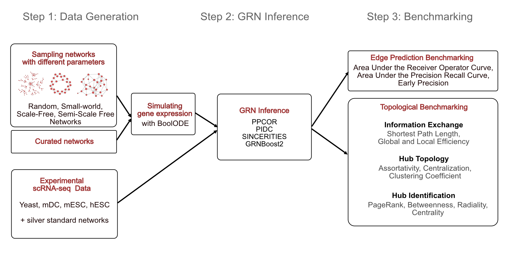

# STREAMLINE: Structural and Topological Performance Analysis of Algorithms for the Inference of Gene Regulatory Networks from Single-Cell Transcriptomic Data

STREAMLINE is a refined benchmarking strategy for GRN Inference Algorithms that focuses on the preservation of topological graph properties as well as the identification of hubs. This repository contains all the scripts that are necessary to perform the analysis and reproduce the figures from the paper. The preprint that contains our findings can be found [here](https://www.biorxiv.org/content/10.1101/2022.10.31.514493v1).



## Installing BEELINE
Before starting with STREAMLINE please make sure to have a stable installation of [BEELINE](https://github.com/Murali-group/Beeline) available.

### Data download
All of the synthetic data, as well as most of the experimental data can be downloaded [here](https://doi.org/10.5281/zenodo.10710445).
After extracting the compressed folders (`/input` and `/output`), they need to be placed in the `/STREAMLINE` directory.
The experimental folders contain a README file each with instructions on the download of the expression and pseudotime files for the experimental datasets from [here](https://doi.org/10.5281/zenodo.5907528) and the unzipping required for the predicted experimental networks.

## Adding own data (optional)
If you want to add your own experimental data, the expression files and ground truth networks need to be copied to the `/input` directory.
If you want to add your own synthetic data, the required files for the `/input` directory are generated by running BoolODE on your synthetic networks:
```
python boolode.py --config config-files/#yourconfig.yaml
```
More information on how to use BoolODE is available [here](https://murali-group.github.io/Beeline/BoolODE.html). 
In both cases, after adding files to the `/input` folder, a matching config file has to be created in the `/config-file`s folder.

### GRN inference (optional)
All inputs for rerunning the GRN inference on our synthetical and experimental data should be located in the `/input` folder after both Zenodo downloads.
In addtion, we also provide the precomputed outputs of the inference step for all algorithms in the `/output` folder, so this step can be skipped for reproducing the published benchmarking section only.
The GRN inference in BEELINE can be done using the following command:
```
python BLRunner.py --config config-files/#yourconfig.yaml
```

## Benchmarking
The benchmarking scripts are implemented as an extension to BEELINE. The folder `/STREAMLINE` contains the modified files for the evaluations as described in the [developer guide for BEELINE](https://murali-group.github.io/Beeline/BEELINE.html#adding-a-new-evaluation-technique) with adapted versions of the `BLEvaluator.py` and BLEval `__init__.py` files.
The global evaluation (per-graph metrics) based on a single configuration file can be started with the following command:
```
python BLEvaluator_adapted.py --config config-files/#yourconfig.yaml --STREAMLINE_global 
```
The local evaluation (per-node metrics) based on a single configuration file can be started with the following command:
```
python BLEvaluator_adapted.py --config config-files/#yourconfig.yaml --STREAMLINE_local 
```
The standard setting evaluates the undirected networks. To run the directed networks, add the `--directed` flag to the commands.
Verbose output can be activated by adding the `--verbose` flag.

For the datasets used in the paper, we also provide a bash script to run the pipeline on all datasets very fast.
The script can be started with:
```
bash STREAMLINE.sh
```
If you add the `-l` flag, it will run the local (per-node) evaluation, if you add the `-g` flag it will run the global (per-graph) evluation and if you add the `-s`flag, it will run the statistical edge detection (EPr / AUC).
If you add the `-d` flag, it will run the evaluations on directed graphs.
The script always runs the synthetic networks, if you want to add the experimental networks as well, you can add the `-e` flag.
The flags can also be combined, e.g. the following command runs the local and global version for synthetic and experimental data:
```
bash STREAMLINE.sh -lge
```

